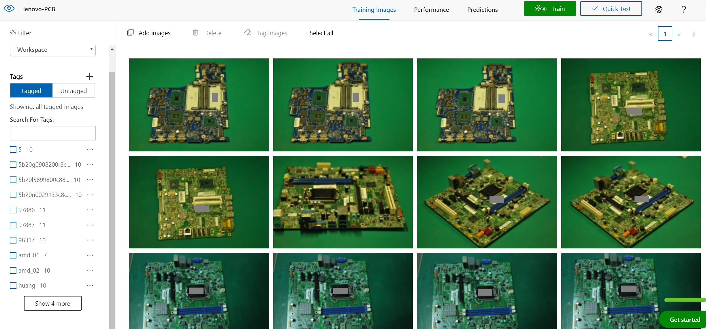
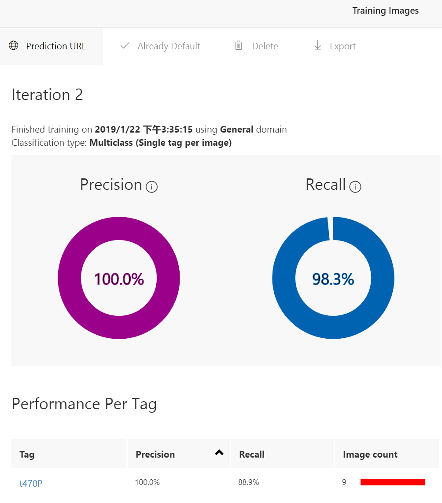
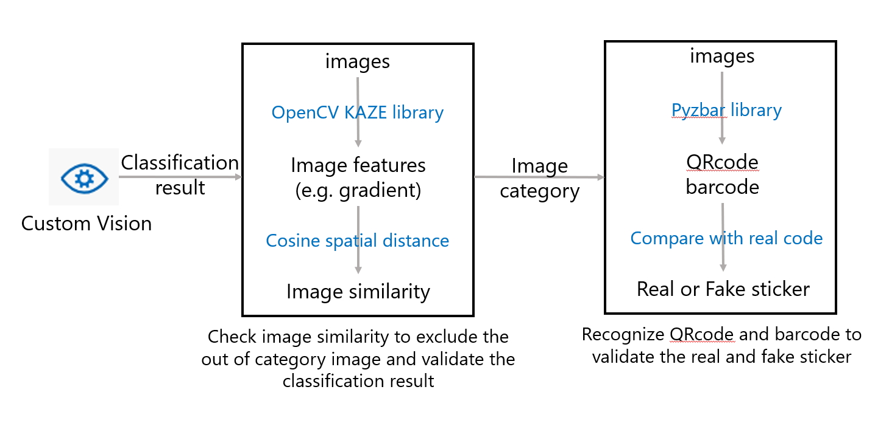

# Circuit Board Image Classfication using Azure Custom Vision

## Background

PC and mobile device OEM always recycles customers' broken circuit board for maintenance. So far, they have to manually classify the type of the circuit board, valide the QRcode or barcode on the board, and recognize the broken part, like burned component, water damage in the board, or component lost. So they have the demands to use computer vision algorithm to detect the necessary part in the circuit board image to reduce their manual efforts. Sample image is as below:

  

## Scenario

Scenario includes three parts:

1. Classify which type the PCB board belongs to.

2. Scan the QRcode and barcode to get the BIOS number,and validate if the code is real (not fake one generated by customers)

3. Identify the lost component, detect the burned component, and water damage part.

In this doc, we implemented the first two scenarios, and third one is still being studied.

## Solution

1. Use Azure Custom Vision classification service to classify the type of the circuit board.

 

 

2. Compare the circuit board image with the standard image of that type, to validate if the classificaiton is correct and two boards are matched. (This is to solve the issue of random out of category image classified into one category when using softmax activation function.) 

    We use OpenCV feature extraction functions (like KAZE) to extract the features of the images, and get the feature similarity of the two images by calculating their cosine spatial distance. The higher score means higher similarity.  ([reference](https://www.pyimagesearch.com/2017/06/19/image-difference-with-opencv-and-python/)).

3. Use open source QRcode and barcode scanner python library ([reference](https://juejin.im/post/5b4ef90b5188251ac9767d61)) to recognize all the QRcodes and barcodes and get the PCB's BIOS ID, and compare it with the standard ID to check if the code sticker is real.

 

## Code Description

The code incudes three parts:

1. Call Azure Custom Vision API to get image category

2. Validate the category result based on OpenCV algorithm

3. Detect QRcode and barcodes and compare them with standard code

